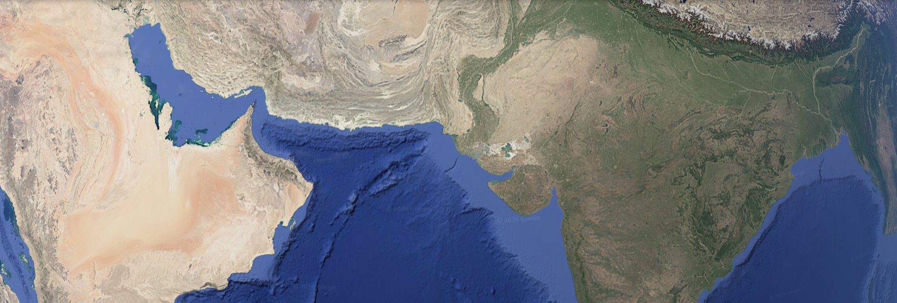
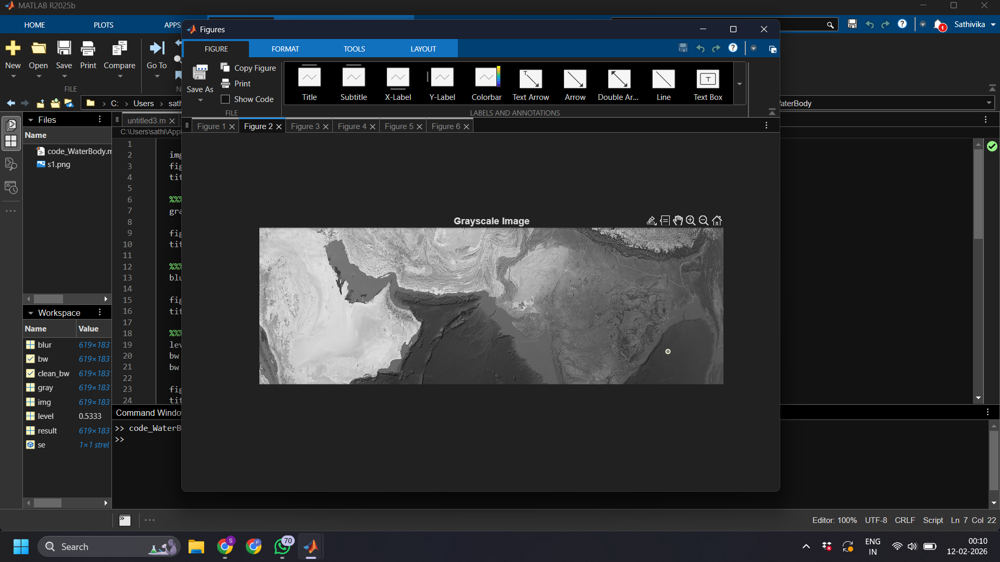
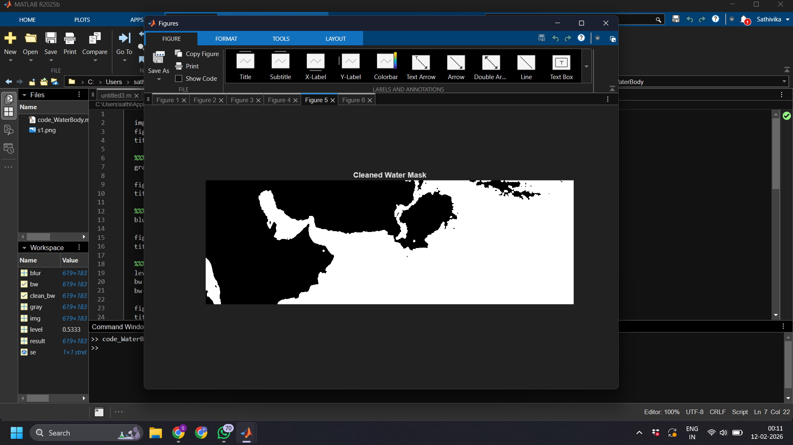
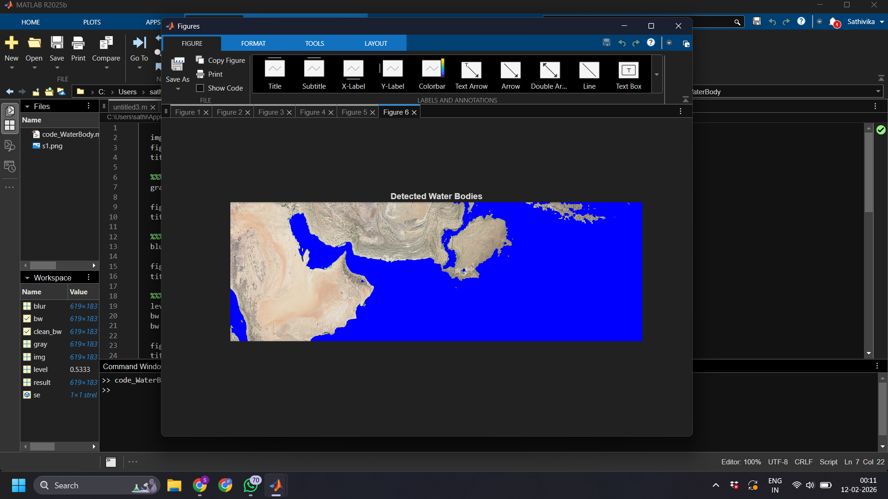

# Water-Body-Detection---Using-Image-Processing

**Water Body Detection using Image Processing (MATLAB)**

**Project Description**

Water bodies such as lakes, rivers, and reservoirs play a crucial role in environmental sustainability and resource management. Manual identification of water regions from satellite images is time-consuming and prone to human error.

This project presents an automated approach to detect water bodies using digital image processing techniques in MATLAB. The system processes satellite images and segments water regions by analyzing pixel intensity and color distribution.

The detection pipeline includes:

-Image preprocessing
-Color space transformation
-Grayscale conversion
-Threshold-based segmentation
-Morphological refinement

<b>Figure 1: Original RGB Image</b>

  

<b>Figure 2: Grayscale Image</b>

  

<b>Figure 3: Smoothed Image</b>

  

<b>Figure 4: Binary Image</b>

  

<b>Figure 5: Cleaned Water Mask Image</b>

  

<b>Figure 6: Detected Water Bodies</b>

  

**The final output highlights water regions clearly, enabling easier monitoring and analysis.**
**This project demonstrates how classical image processing techniques can be effectively used for environmental monitoring without relying on complex deep learning models.**
